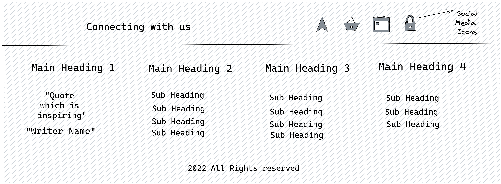

# PaperZone

[Live link of website](https://paperzone.netlify.app/)<br>
<br>
During my college time finding resources for exam prepartion was a hectic task. So, I decided to build a website which will
act as a central system for providing helpful resources.<br>
This website helps **Bundelkhand University Computer science students** by keeping all necessary resource like **"Question papers, Youtube playlist, Notes, Book PDf, Lab Manual and Short notes.**

## Step 1: Tech Stack
```
1. HTML
2. CSS
3. JavaScript
4. Bootstrap
```
## Step 2: Design Layout

<p float="left">
  
   
  
  
</p>
<br>
<p float="left">
   
  
  
</p>
<br>


## Step 3: Website overview
```
1. Landing page divided into 4 Parts
    - Hero Section
    - Feature Section
    - How to contribute Section
    - Footer
    
2. On clicking paper Button 
    - Will find tabs with semester name 
    
3. On clicking these tabs you will get 
    - All Necessary resources
    
4. On clicking read more button in contribution section
   - Will get ways to contribute
```

## Features of site
```
1. Responsive experience throught major screen size.
2. Major portion of website is sketched-> then designed-> then coded
3. Hosted on Netlify
